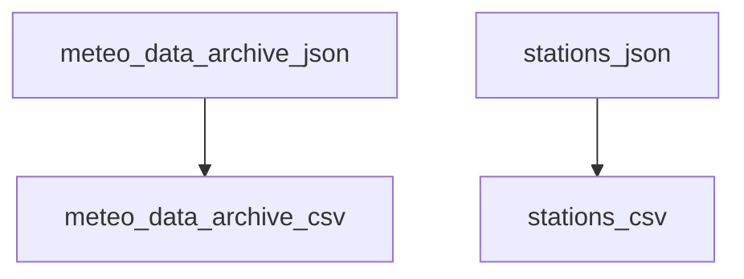

# slo-weather

Archive of meteorological observations by ARSO.


## Data pipelines

### Input:
XMLs with data in 10-min intervals. An XML can overlap with
up to two days of already ingested data.

### Outputs:
 - (Archives) CSVs with deduplicated 10min interval data
 - Data for visualizations (example: sliding window of rainfall in last 3 days)


## Running pipeline

```
PYTHONPATH=. poetry run python ./data_pipeline/02_parse_meteo_data_archive.py

```


## Pipeline v2


